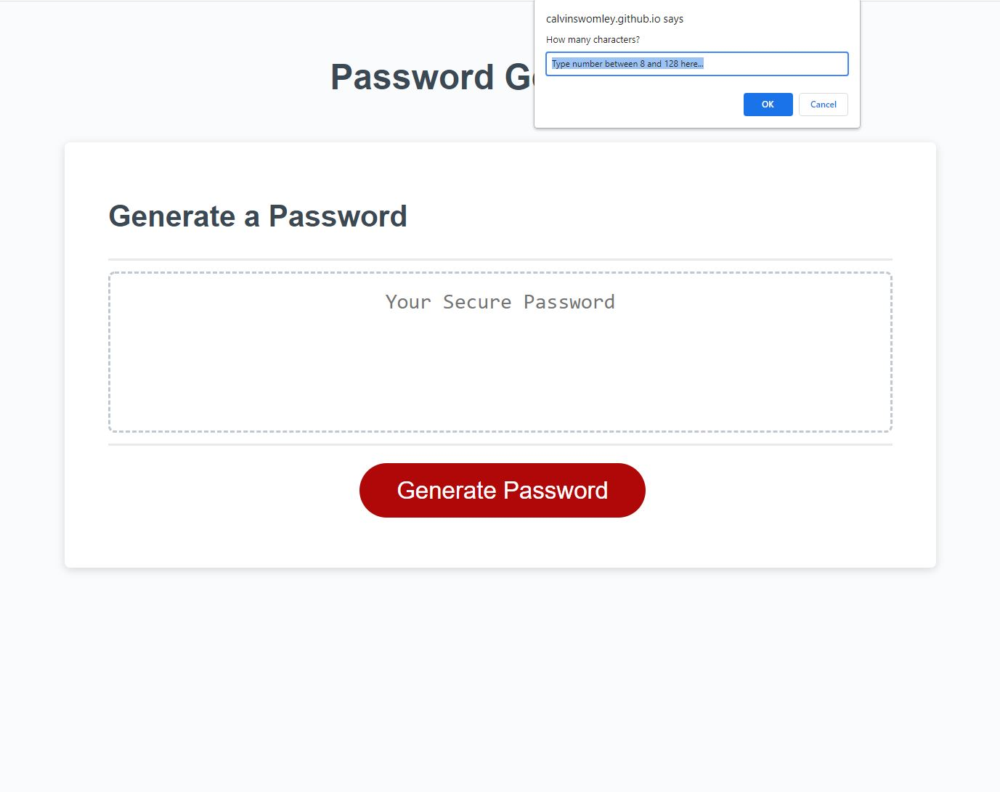

# Homework3-PasswordGenerator
Week 3 JavaScript: Homework 3: Password Generator

Description: This web application randomly generates passwords for users. Users are prompted with password criteria questions to fit their particular needs. The Javascript code takes the user criteria inputs and randomly generates a password that meet their specified criteria. This password generator helps users create more secure passwords by random generation with a variety of possible character types and password lengths. The JavaScript code utilizes for loops, if/else statements, functions and event listeners.

Completed Refactor Screenshot:

Link to Deployed Application: https://calvinswomley.github.io/Homework3-PasswordGenerator/
